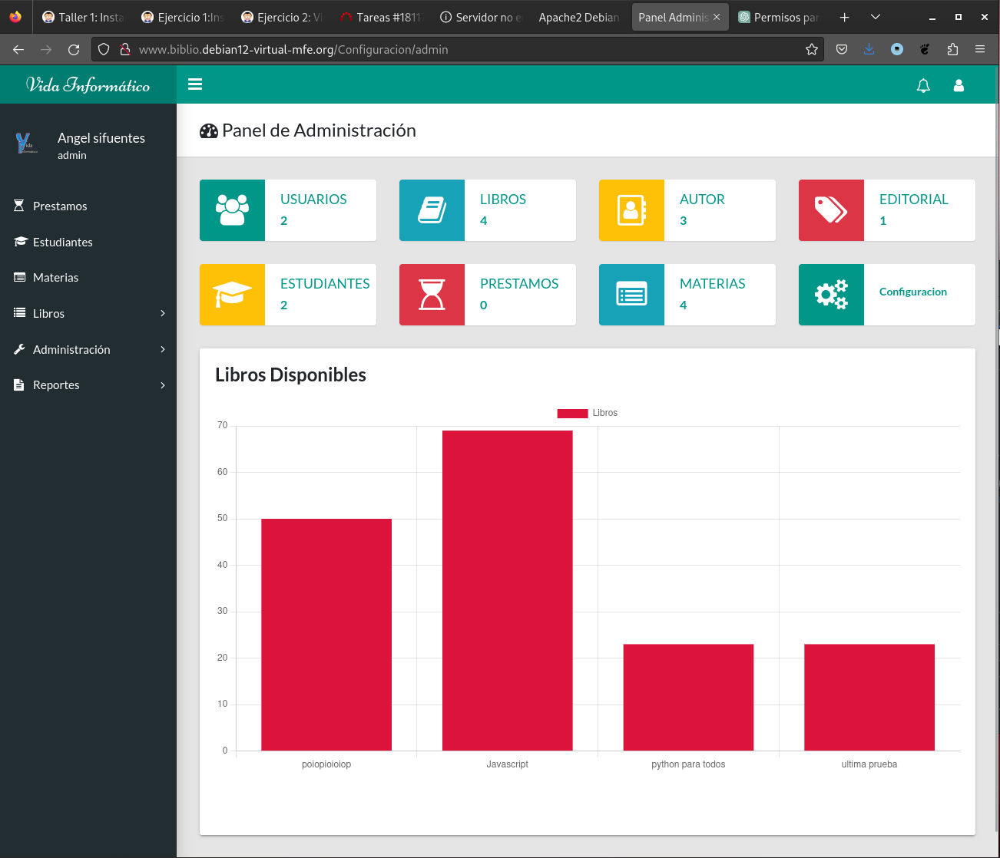
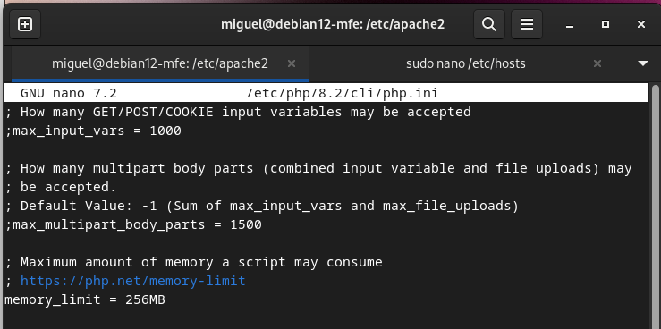

Creamos la base de datos, y un usuario para este taller, con nombre taller1php ambos. Rellenamos la base de datos con el fichero biblioteca.sql clonado desde Git, usando el siguiente comando:

`mysql -u taller1php -p taller1.php < biblioteca.sql`

## Configuración del VirtualHost

```
<VirtualHost *:80>
        ServerName www.biblio.debian12-virtual-mfe.org
        ServerAdmin webmaster@localhost
        DocumentRoot /var/www/biblio
        ErrorLog ${APACHE_LOG_DIR}/error.log
        CustomLog ${APACHE_LOG_DIR}/access.log combined
</VirtualHost>
```

## Fichero `Config.php`

```
<?php
const base_url = "http://www.biblio.debian12-virtual-mfe.org/";
const host = "localhost";
const user = "taller1php";
const pass = "iesgn";
const db = "taller1php";
const charset = "charset=utf8";
?>
```

## Acceso a la aplicación


## Fichero modificado para límite de memoria
`/etc/php/8.2/cli/php.ini`

