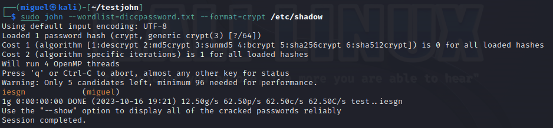
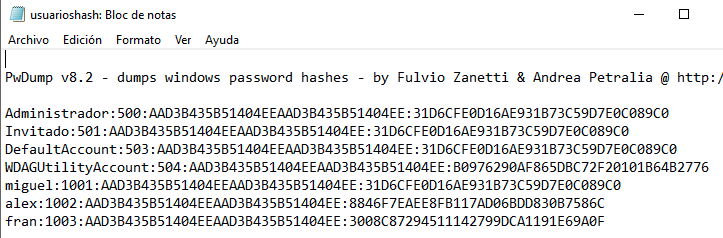
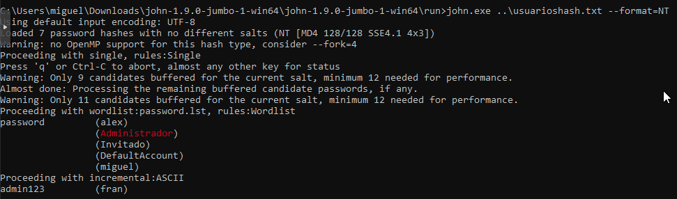

# Herramienta de comprobación de fortaleza de contraseñas

## *John the Ripper*

### Rúbrica

- Instalación
- Opciones de ataques de diccionario
- Opciones de ataques de fuerza bruta
- Generación de diccionarios siguiendo reglas
- Comprobación en local y en remoto
- Crackeo cuenta Linux
- Crackeo cuenta Windows

### Introducción

En este apartado de comprobación de fortaleza de contraseñas usaremos *John the Ripper.* Esta es una herramiento de crackeo de contraseñas escrita en C y muy utilizada por los analistas de seguridad para comprobar la robustez de una clave frente a ataques de fuerza bruta o por diccionario.

Esta herramienta es capaz de detectar de forma automática el tipo de hash que estamos crackeando. Puede romper hashes como MD5, SHA-1 y otros muchos ampliamente utilizados en el mundo informático

### Instalación de la herramienta

Con la ejecución del comando `apt install john` instalamos la herramienta. Una vez instalada, podemos realizar una prueba de rendimiento del hardware sobre el que correremos esta herramienta con el comando `john --test`. De esta manera, podremos saber la velocidad con la que la herramienta probará claves con diferentes tipos de cifrado utilizando el 100% de la CPU.

Sobre un contenedor en Proxmox con Debian12 nos arroja los siguientes resultados:


### Opciones de ataque por diccionario

#### Uso en Linux

> Por problemas de dependencias con la instalación de "John the Ripper" en el contenedor de debian12, instalamos una MV con Kali Linux donde haremos estas pruebas y donde se incluye ya la herramienta completamente funcional.

Para probar los ataques por diccionario lo haremos con el fichero `/etc/shadow`, que es el que contiene la contraseñas cifradas en los sistemas Linux.

A continuación deberemos tener o crear un diccionario de claves. Estos diccionarios se pueden obtener de Internet, pero para esta prueba crearemos uno sencillo con algunas claves típicas y entra la que inlcuiremos *iesgn*, que es la clave del usuario *miguel* de Kali.

> Podemos encontrar wordlists en el propio repositorio de John the Ripper, clasificados por lenguajes, en el siguiente enlace: <https://download.openwall.net/pub/wordlists/>
>
> En el fichero `/usr/share/john/password.lst` se almacenan todas las palabras que usará por defecto la herramienta para intentar descifrar la contraseña.

Este es el contenido del fichero `diccpassword.txt`:

```
test
contrasena
1234
password
iesgn
```

A continuación, ejecutaremos John the Ripper para cracker la contraseña del fichero `/etc/shadow` tomando como diccionario el fichero `diccpassword.txt`. Lo hacemos con el comando `john --wordlist=diccpassword.txt --format=crypt /etc/shadow`. Con el parámetro `--format` indicamos el formato del hash. Indicamos `crypt` si lo desconocemos.



Como vemos en la captura anterior, la clave del usuario *miguel* era *iesgn*, y ha tardado prácticamente ni 1 segundo, ya que el diccionario de claves solo tenía 5 líneas y entre ellas estaba la correcta.

Las contraseñas que vayamos descifrando se almacenarán en el directorio oculto `./john`, en el fichero `john.pot`.

De esta forma hemos crackeado una cuenta en Linux. Tan sólo nos ha bastado con tener acceso al fichero `/etc/shadow` por un momento.

#### Uso en Windows

Ahora pasaremos al sistema Windows, para crackear una cuenta de usuario. Crearemos un par de cuentas, con los siguientes nombres de usuario y contraseñas:

| **Usuario** | **Contraseña** |
|:-------:|:----------:|
| alex | password |
| fran | admin123 |

Creamos la cuenta con el comando `net user [nombre] /add`, y le ponemos contraseña con `net user [nombre] *`.

Una vez creados, descargaremos la herramienta John the Ripper para Windows desde la página oficial: <https://www.openwall.com/john/>, la versión *jumbo release*.

Además, deberemos descargar también la herramienta pwdump8, desde el siguiente enlace <https://www.openwall.com/passwords/windows-pwdump>, que nos permitirá generar un archivo de texto con el estilo `usuario:contraseñacifrada`.

> Antes de descargar este archivo deberemos desactivar Windows Defender, ya que nos lo notificará como peligroso para el sistema.

Ejecutamos la herramienta pwdump8 y redirijimos su salida al fichero `usuarioshash.txt`. Observamos el archivo que se ha generado:



Ahora pasaremos ese fichero generado por John the Ripper. El comando es similar a Linux. Nos da esta respuesta:



Ha descifrado correctamente las contraseñas de *alex* y *fran*, que realmente son los únicos usuarios que tienen contraseña ya que no le hemos configurado contraseña al usuario *miguel*. Este proceso ha usado las wordlist por defecto que hemos descargado con la herramienta.

### Opciones de ataque por fuerza bruta

Un ataque de contraseñas por fuerza bruta es un método utilizado para intentar descubrir una contraseña al probar todas las posibles combinaciones de caracteres hasta encontrar la correcta. En esencia, este tipo de ataque implica probar repetidamente todas las combinaciones posibles de contraseñas hasta que se encuentre la que permite el acceso a una cuenta o sistema. Los atacantes utilizan software automatizado para generar y probar estas combinaciones a gran velocidad.

Los ataques de fuerza bruta son un enfoque ineficiente y generalmente lento, ya que la cantidad de combinaciones posibles puede ser extremadamente grande, especialmente si la contraseña es larga y compleja. Sin embargo, pueden ser efectivos si la contraseña es débil, es decir, corta o predecible.

Para probar este tipo de ataques, crearemos dos nuevos usuarios en nuestra máquina con Kali. En ella crearemos los usuarios *alex* y *fran*, con las mismas contraseñas que se especificaron anteriormente.

Con el comando `unshadow /etc/passwd /etc/shadow > combinado.txt` combinamos los contenidos de ambos archivos, y este será el archivo que luego pasaremos por John.

Pasamos el archivo por John para que comience el ataque por fuerza bruta:


En primer lugar vemos como la contraseña del usuario *alex* la ha descifrado utilizando el método de ataque por diccionario. Pero ahora está intentando descifrar el resto de contraseñas por fuerza bruta. Vemos como la máquina está empleando toda la potencia disponible de procesamiento en sucesivos intentos de cracker las claves:


Obviamente estábamos forzando con la segunda contraseña a probar todas las combinaciones posibles, sin ninguna ayuda por lo que se demorará bastante en conseguir un resultado, algo que no sería viable.

Como hemos visto y comprobado, para prevenir de los ataques de contraseñas por fuerza bruta debemos configurar contraseñas largas, con letras, números y símbolos cuando sea posible, así como habilitar la autentificación de doble factor cuando sea posible.

### Generación de diccionarios para fuerza bruta

<https://thehackerway.com/2021/01/20/generacion-de-diccionarios-para-fuerza-bruta-con-pydictor/>